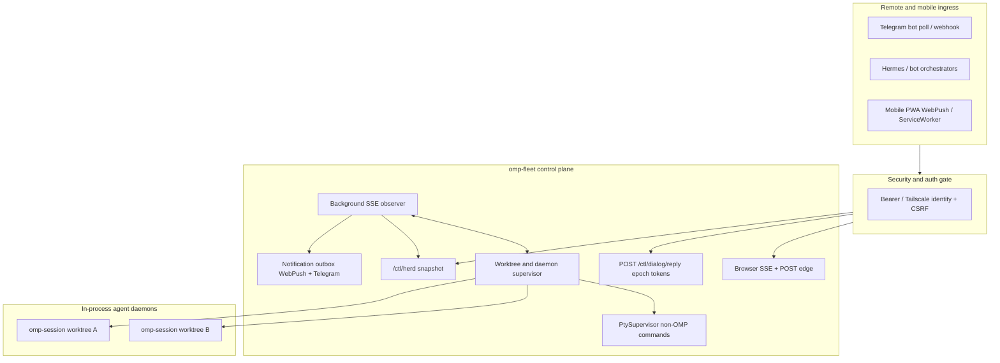

# OMP-Web Convergence Blueprint: Herdr and Collie capabilities in OMP-Web

## Overview

Bring Herdr + Collie remote steering, alerting, and mobile triage into omp-web without abandoning the SDK-native cockpit. SSE stays the event source. Fleet projects a REST snapshot for bots. Dialog replies are epoch-scoped. Notifications and PWA are optional add-ons. Generic PTYs stay off the daemon template path.

**Status (2026-08-22):** Phases 1–4 are implemented in this tree. This file is the as-built spec, not a backlog.

---

## 1. Architecture

---

## 2. As-built tracks

### Phase 1: Security and fleet read-model

Shipped.

1. **Auth and CSRF (`fleet/auth.ts`, gated in `fleet/server.ts` `#fetch`):**
   - Off-loopback `/ctl` and `/command` require `Authorization: Bearer` / `?token=` matching `config.token`, or `Tailscale-User-Login` when `--tailscale-auth` and the peer is Tailscale CGNAT (`100.64/10`) or loopback.
   - Mutating methods need CSRF: `x-omp-csrf` == token, same-origin Host, bearer already accepted, or loopback peer + loopback Origin (vite proxy). Missing Origin on loopback is CLI and is allowed.
   - `assertFleetBindSafe`: non-loopback bind without token and without tailscale auth is a startup error.
   - Flags/env: `--host` / `OMP_FLEET_HOST`, `--token` / `OMP_FLEET_TOKEN`, `--tailscale-auth` / `OMP_FLEET_TAILSCALE_AUTH`.
2. **Herd projector (`fleet/projector.ts`):**
   - In-memory: boot epoch, streaming, blocked, pending dialogs, optional tool name.
   - `GET /ctl/herd` returns `{ daemons: [...] }` with live status `idle | streaming | blocked_ui | error | offline`. Tokens and endpoints are never included.
3. **Dialog reply (`fleet/dialog-reply.ts`, `POST /ctl/dialog/reply`):**
   - Body `{ epochToken, action?, result?, idempotencyKey? }`.
   - Epoch token is `daemonId:bootEpoch:requestId`. Stale epoch after `markReady` is `expired`.
   - Method-checked payload (`confirm`, `select`, `input`, `askDialog`). Idempotency key defaults to the epoch token.
   - Returns `{ status: "applied" | "already_applied" | "expired" }`. Applied replies go out as `ui_response` on the connector.

CLI: `omp-web herd`, `omp-web dialog-reply --epoch <t> [--action a] [--result r] [--idempotency k]`.

### Phase 2: Observer and notifications

Shipped.

1. **Observer (`fleet/observer.ts`, daemon `?role=observer`):**
   - Taps connector frames while the control stream is live.
   - On idle-drop of a still-ready daemon, opens `GET /events?role=observer` with the daemon bearer.
   - `SseConsumer.observer` is ignored by `isIdleSuppressed()`: observer streams do not pin the 30-minute idle auto-exit.
   - Feeds the projector and the notification dispatcher on `ui_request` and `agent_end`.
2. **Notifications (`fleet/notifications/`):**
   - WebPush: RFC 8291/8292 in `webpush.ts` (no `web-push` npm). Needs `notifications.vapid` or `OMP_FLEET_VAPID_{PUBLIC_KEY,PRIVATE_KEY,SUBJECT}`. Routes: `GET /ctl/push/vapid`, `POST /ctl/push/subscribe`, `POST /ctl/push/unsubscribe`.
   - Telegram: `telegram.ts` markdown + inline keyboards. Config `notifications.telegram` or `OMP_FLEET_TELEGRAM_{BOT_TOKEN,CHAT_ID}` plus optional `WEBHOOK_SECRET` and `POLL=1`. Webhook: `POST /ctl/telegram/webhook`. Callback data is a short `tN` id (Telegram 64-byte cap) mapped to an epoch binding.
   - Redaction: `redact.ts` truncates and strips bearer-like secrets.

### Phase 3: Mobile PWA

Shipped (layout tokens in CSS; device QA is still operator-side).

1. **Packaging:** `public/manifest.webmanifest`, `public/icon.svg`, `public/sw.js` (vite copies `public/` to `dist/`). Not `src/sw.ts`.
2. **Client:** `src/pwa.ts` registers the SW, subscribes Web Push when desktop notifications are enabled, honors `?daemon=` / `?dialog=`, and handles `omp-notify-open` from `notificationclick`.
3. **Chrome:** `viewport-fit=cover`, `interactive-widget=resizes-content`, `100dvh`, `env(safe-area-inset-*)` on body, app shell, and sidebar toggle.

### Phase 4: Generic PTY supervision

Shipped.

- `fleet/pty-supervisor.ts`: piped stdio (not a real tty), 512 KiB output ring, max 32 workers, isolated from SDK spawn templates.
- Routes: `POST /ctl/pty`, `GET /ctl/pty`, `GET /ctl/pty/:id`, `GET /ctl/pty/:id/events`, `POST /ctl/pty/:id/input`, `DELETE /ctl/pty/:id`.
- CLI: `pty-spawn --command <cmd> [--cwd d]`, `pty-list`, `pty-kill <id>`.

---

## 3. Tests that lock the contract

- `fleet/auth.test.ts`
- `fleet/projector.test.ts`
- `fleet/dialog-reply.test.ts`
- `fleet/observer.test.ts`
- `fleet/pty-supervisor.test.ts`
- `fleet/notifications/dispatcher.test.ts`
- `fleet/server-herd.test.ts` (herd + dialog + pty over a real fleet + fake daemon)

---

## 4. Known gaps (not silent shrink)

- WebPush is a no-op until VAPID keys are configured.
- Telegram is a no-op until bot token + chat id are configured.
- PWA install / iOS-Android gesture QA was not browser-driven in the implementation session.
- `server/omp-session` off-loopback static `GET /` still needs a built `dist/` (or embedded dist from `bun run build`).
